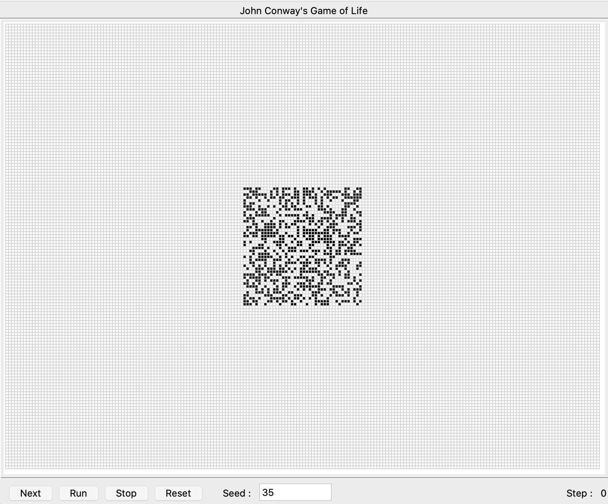
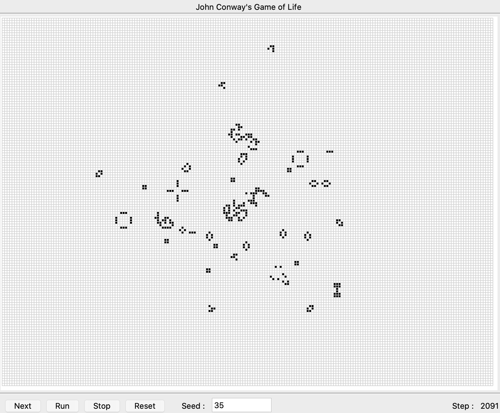

# Game of life visualisation GUI

This program offers a TkInter GUI to visualize the evolution of cells following the rules of John Conway's Game of Life.
### Game of Life

The game of life is a Turing state machine representing the evolution of cells over time.  
The initial state defines which cells are alive at the start of the game.  

Then the following step is calculated with the following rules:
- any alive cell with 2 or 3 alive neighbors stays alive, else it dies
- any dead cell with 3 alive neighbors becomes alive.

By repeating these rules, the system reaches a stable state, with some interesting patterns :
- some still shapes (like a 2x2 square)
- some oscillators (like a line of 3 live cells)
- some shapes performing a linear translation over time, called "spaceships"


### Running the program

The program requires Python 3 and the graphical library Tkinter.  
On macOS they can be installed with :
```
brew install python3
brew install python-tk
```

Then the program can be started with :
```
python ./game_of_life.py
```

A GUI will be displayed with a grid of 40x40 cells randomly set to dead or alive.  
The seed used to decide this initial state can be set to a specific value to observe different evolutions.



The evolution of the cells can be observed with the "Run" button, or analyzed step by step with the "Next" button.



